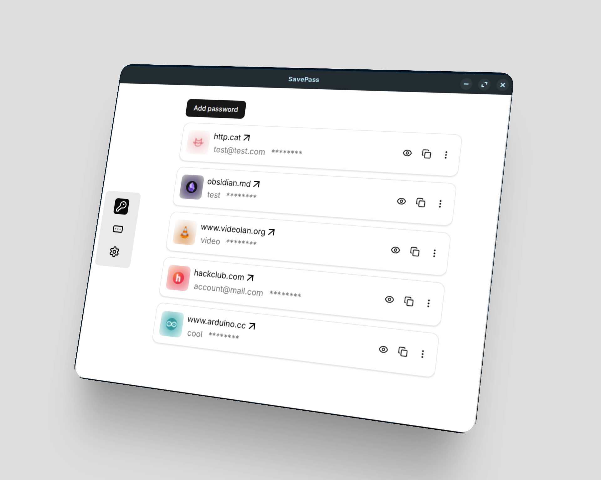

<h1 align="center" id="title">Save Pass</h1>

<p id="description">A simple password manager that stores your passwords and TOTP codes in one place with the ability to sync all your data across devices including your phone.</p>

<div align="center">

 [](https://github.com/royaly-dev/savepass/releases/latest)

</div>



> **Note:** To view the mobile app go to the savepass_mobile branch or download it in the release

<h2>🚀 Features</h2>

Here're some of the project's best features:

*   Save your password
*   Save your TOTP code (like an Authenticator app)
*   Sync between devices (on the same network)
*   Import / Export your data in a JSON file

<h2>🛠️ Installation Steps ( for windows ):</h2>

1. Go to <a href="https://github.com/royaly-dev/savepass/releases/latest">GitHub Releases</a> and download the latest update

2. Execute the installeur

3. Let the onboarding process guide you

4. enjoy the app !

<h2>🛠️ Installation Steps ( for linux ):</h2>

1. Go to <a href="https://github.com/royaly-dev/savepass/releases/latest">GitHub Releases</a> and download the latest update

2. Install on your system :

    - Debian Based :

        ```bash
        dpkg -i savepass_linux_{arch}.deb
        ```

    - flatpak :
    
        ```bash
        flatpak install savepass_linux_{arch}.flatpak
        ```

    - AppImage :

        ```bash
        chmod +x savepass_linux_{arch}.AppImage
        ```

        ```bash
        ./savepass_linux_{arch}.AppImage
        ```

3. Let the onboarding process guide you

4. enjoy the app !


<h2>🛠️ Build it from source :</h2>

1. First clone this repositorie :

    ```bash
    git clone https://github.com/royaly-dev/savepass.git
    ```

2. Then install dependency :

    ```bash
    npm install
    ```

    ```bash
    apt install flatpak flatpak-builder rpm
    ```

    ```bash
    flatpak remote-add --if-not-exists --user flathub https://dl.flathub.org/repo/flathub.flatpakrepo
    ```

    > **Note:** The flatpak, flatpak-builder and rpm packages is need to be installed in order to build the app.
    >
    >Also **you need** to install on flatpack these components : 
    flathub org.freedesktop.Sdk//24.08 - org.freedesktop.Platform//24.08 - org.electronjs.Electron2.BaseApp

3. Now you can build from source !

    ```bash
    npm run make
    ```

<h2>✨ Credits</h2>
This project was mostly written by me, but to fix some issues I had with the electron-forge builder I asked GitHub Copilot to help me figure out what was wrong.
